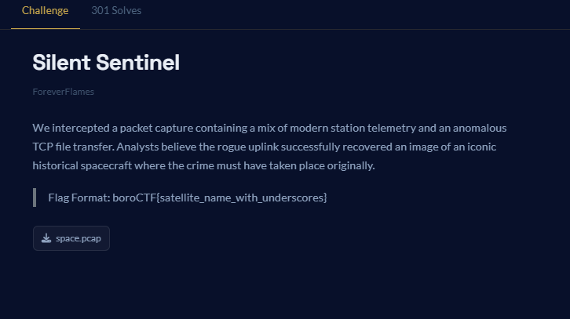

# BOROCTF

1. 
    
    
    

From tcp stream

.This image was obtained from the Smithsonian Institution. The image or its contents may be protected by international copyright laws...x.-Satellite, Vanguard 1, Backup

boroCTF{vanguard_1}

1. 

1. 

After binwalk: 

binwalk -e billie.jpg

dd if=billie.jpg of=inside.zip bs=1 skip=134843

unzip -l inside.zip

Cracking the zip file password using john

zip2john inside.zip > hash.txt
john hash.txt

john --wordlist=/usr/share/wordlists/rockyou.txt hash.txt

john --show hash.txt

Upon opening the eilish.png we see the flag on the t-shirt. 

1. 

ICMP contained these random characters

W W F z X 0 1 h c m l u Y V 9 D a X J j d W l 0

which is Yas_Marina_Circuit when converted from base64

boroCTF{Yas_Marina_Circuit}

1. 

mkdir recover
sudo mount -o loop,offset=$((128*512)) challenge.vhd /mnt

fls -o 128 challenge.vhd

unzip challenge.zip
ls

mmls challenge.vhd

fls -r -o 128 challenge.vhd

icat -o 128 challenge.vhd 39 > deleted.zip
icat -o 128 challenge.vhd 43 > metadata.bin

file deleted.zip
unzip -l deleted.zip

7z l deleted.zip

zip2john deleted.zip > hash.txt
cat hash.txt

john hash.txt --wordlist=/usr/share/wordlists/rockyou.txt

john --show hash.txt

Password: forget92936281

7z x -pforget92936281 deleted.zip

cat flag.txt